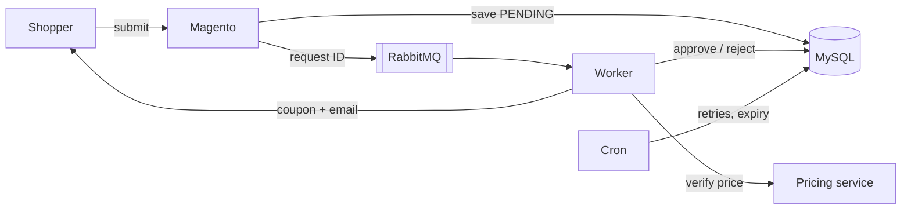
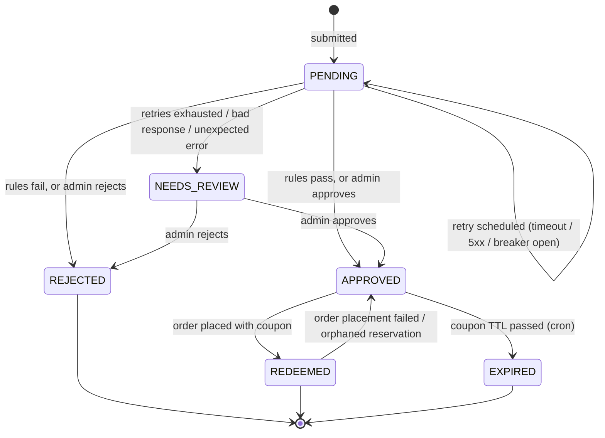

# Price Match module documentation

## Summary

A shopper who finds one of our products cheaper elsewhere clicks **Price match** on the product page, pastes the competitor link and price, and gets an answer within a couple of seconds. If the price checks out, they get a coupon code that takes the difference off that one item. It only works for their account, on that product, for one unit, and for 48 hours.

For the merchant, that replaces an email to customer service and a manual coupon. Admins still see every request, with its history, and can approve or reject anything the system couldn't decide.

It's a standard Magento module (`MagentoGuy_PriceMatch`) installed through Composer. It has a Luma UI, a GraphQL API for headless storefronts, an admin grid, and a small mock "pricing authority" service under `dev/` that stands in for a real competitor price checker.

## Assumptions

- **Logged-in customers only.** I need an identity to rate-limit requests and to tie the coupon to someone. Guests are asked to sign in.
- **One unit per match.** Matching a whole cart is an open door for resellers.
- **"Our price" is what this customer would actually pay:** the final price including catalog rules for their customer group. I check it at submit time and again when the request is evaluated, because prices change.
- **Never below cost.** If a product has a `cost` value, no match goes under it, including manual approvals.

## How it works

The submit does minimal work: validate the input, look up the product and our price, check the rate limits, insert a `PENDING` row, and publish the request ID to RabbitMQ. The shopper gets a response right away, and the page polls a status endpoint every 2 seconds.

A queue consumer picks up the ID, re-reads the row, and calls the pricing service with a 3-second timeout. If the service is slow or returns a 5xx, the request isn't failed. I record when it should be tried again (30s, then 120s, then 600s), and a cron job republishes it when it's due. After the third retry it goes to **Needs Review** for an admin. A small circuit breaker stops calling the service for 60 seconds after 5 failures in a row, so an outage doesn't pile up timeouts.

On approval, the worker generates a coupon and moves the request to `APPROVED` in the same transaction, then emails the shopper.

The coupon is checked again at checkout. A plugin on Magento's coupon validation confirms that the code belongs to an approved request for *this* customer, hasn't expired, and that the matched SKU is in the cart. The discount itself comes from a custom rule action that takes the approved amount off one unit of that SKU and nothing else.

## Decisions

**One cart rule, many coupons.** The obvious approach is to create a cart price rule for each approved request. I didn't, because Magento evaluates every active cart rule each time it recalculates totals, so a few thousand approvals would slow down every checkout in the store, not just price-match ones. Instead, a data patch creates a single system rule, and each approval adds one generated coupon to it. A built-in "fixed amount" action can't express a different amount per coupon, so I added a custom action (`price_match_fixed`) that reads the amount from the request. That keeps Magento's normal coupon handling, order labels and reports.

**The database is the source of truth and the queue is just a trigger.** Messages carry only the request ID. If a message gets lost, the cron finds requests that have been sitting in `PENDING` and republishes them. If one is delivered twice, the second consumer can't claim the row and skips it. Retries live in the row (`next_attempt_at`) rather than in broker delay queues, so they show up in the request history and survive a RabbitMQ restart. The cost is that retry timing is only as precise as the one-minute cron, which is fine for something measured in minutes.

**Fail closed.** If the pricing service can't give a clear yes, nothing gets approved automatically. Timeouts are retried; anything strange (a 4xx, malformed JSON) goes straight to an admin for manual review.

## Security

| Risk | What stops it |
|---|---|
| Someone else uses my coupon | Coupon is checked against the logged-in customer's ID every time totals are calculated |
| Same coupon used twice, e.g. two tabs | `APPROVED → REDEEMED` reservation before the order is placed; only one wins |
| Fake competitor site | Domain allow-list (plus subdomains); the pricing service confirms the actual price |
| XSS through the URL field | Unsafe characters rejected at input; all output escaped |
| Looking up other customers' requests | Anything that isn't yours returns the same "not found" as a missing ID |
| Pricing service down | Never auto-approves; retries, then manual review |

Everything else is the usual Magento plumbing: form keys on the storefront POST, a customer token for GraphQL, separate ACL permissions for viewing requests, approving them, and changing settings, and the pricing service API key stored encrypted in config.
